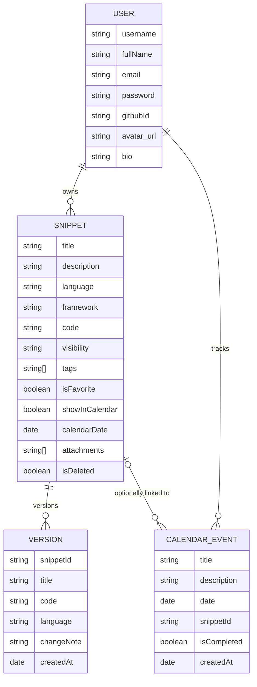

```mermaid
erDiagram
    USER ||--o{ SNIPPET : owns
    USER ||--o{ CALENDAR_EVENT : tracks
    SNIPPET ||--o{ VERSION : versions
    SNIPPET |o--o{ CALENDAR_EVENT : "optionally linked to"

    USER {
        string username
        string fullName
        string email
        string password
        string githubId
        string avatar_url
        string bio
    }

    SNIPPET {
        string title
        string description
        string language
        string framework
        string code
        string visibility
        string[] tags
        boolean isFavorite
        boolean showInCalendar
        date calendarDate
        string[] attachments
        boolean isDeleted
    }

    VERSION {
        string snippetId
        string title
        string code
        string language
        string changeNote
        date createdAt
    }

    CALENDAR_EVENT {
        string title
        string description
        date date
        string snippetId
        boolean isCompleted
        date createdAt
    }
```