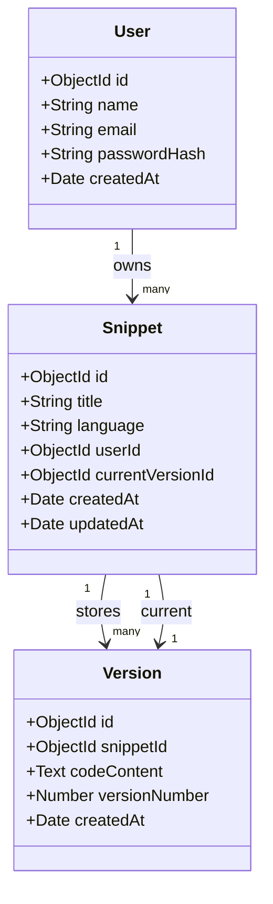

```mermaid
classDiagram

class User {
  +ObjectId id
  +String name
  +String email
  +String passwordHash
  +Date createdAt
}

class Snippet {
  +ObjectId id
  +String title
  +String language
  +ObjectId userId
  +ObjectId currentVersionId
  +Date createdAt
  +Date updatedAt
}

class Version {
  +ObjectId id
  +ObjectId snippetId
  +Text codeContent
  +Number versionNumber
  +Date createdAt
}

User "1" --> "many" Snippet : owns
Snippet "1" --> "many" Version : stores
Snippet "1" --> "1" Version : current
```