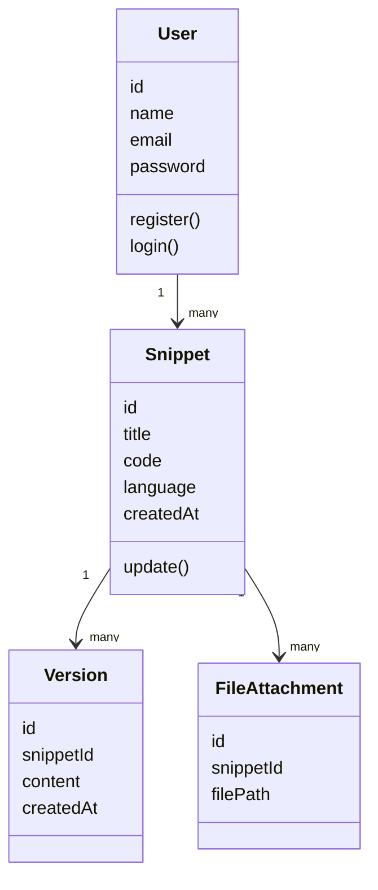

```mermaid
classDiagram

class User {
  id
  name
  email
  password
  register()
  login()
}

class Snippet {
  id
  title
  code
  language
  createdAt
  update()
}

class Version {
  id
  snippetId
  content
  createdAt
}

class FileAttachment {
  id
  snippetId
  filePath
}

User "1" --> "many" Snippet
Snippet "1" --> "many" Version
Snippet "1" --> "many" FileAttachment
```