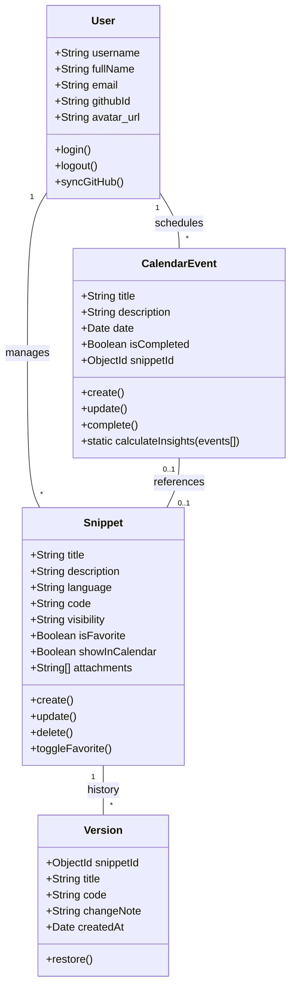

```mermaid
classDiagram
    class User {
        +String username
        +String fullName
        +String email
        +String githubId
        +String avatar_url
        +login()
        +logout()
        +syncGitHub()
    }

    class Snippet {
        +String title
        +String description
        +String language
        +String code
        +String visibility
        +Boolean isFavorite
        +Boolean showInCalendar
        +String[] attachments
        +create()
        +update()
        +delete()
        +toggleFavorite()
    }

    class Version {
        +ObjectId snippetId
        +String title
        +String code
        +String changeNote
        +Date createdAt
        +restore()
    }

    class CalendarEvent {
        +String title
        +String description
        +Date date
        +Boolean isCompleted
        +ObjectId snippetId
        +create()
        +update()
        +complete()
        +static calculateInsights(events[])
    }

    User "1" -- "*" Snippet : manages
    User "1" -- "*" CalendarEvent : schedules
    Snippet "1" -- "*" Version : history
    CalendarEvent "0..1" -- "0..1" Snippet : references
```