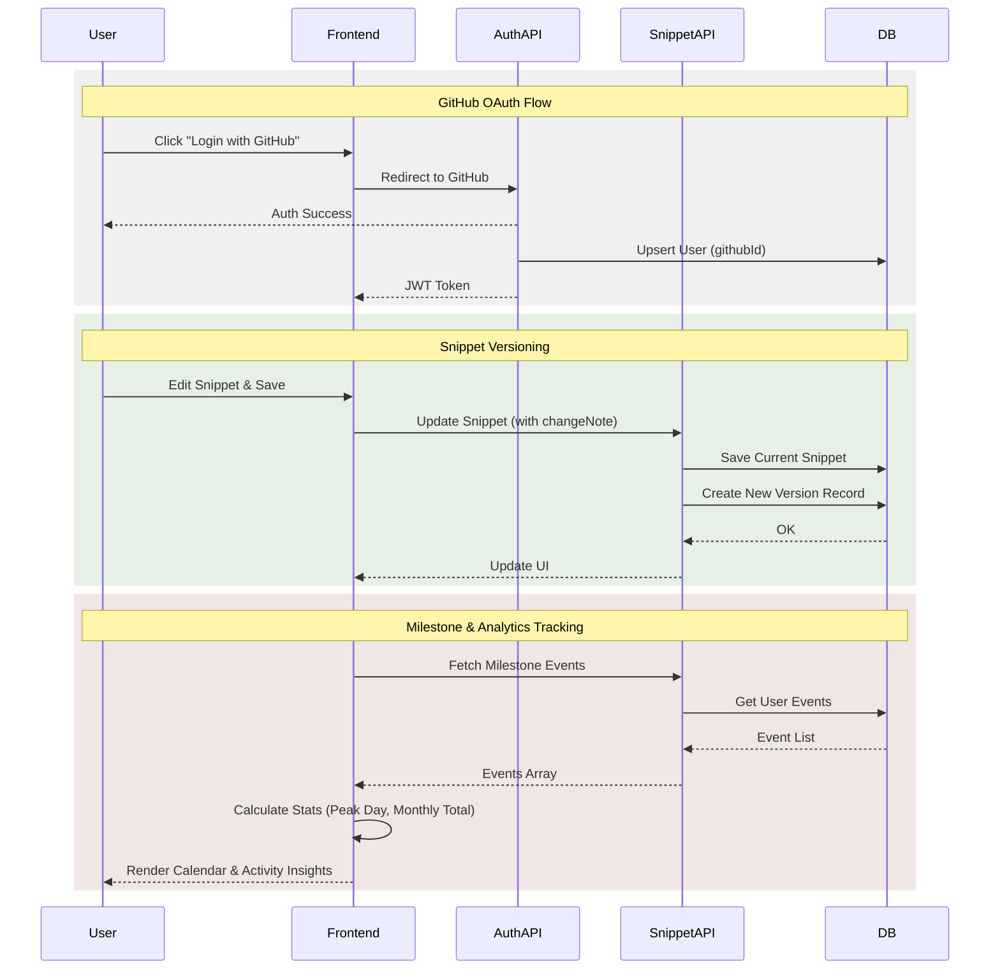

```mermaid
sequenceDiagram
    participant User
    participant Frontend
    participant AuthAPI
    participant SnippetAPI
    participant DB

    %% Auth Flow
    rect rgb(240, 240, 240)
        Note over User, DB: GitHub OAuth Flow
        User->>Frontend: Click "Login with GitHub"
        Frontend->>AuthAPI: Redirect to GitHub
        AuthAPI-->>User: Auth Success
        AuthAPI->>DB: Upsert User (githubId)
        AuthAPI-->>Frontend: JWT Token
    end

    %% Versioning Flow
    rect rgb(230, 240, 230)
        Note over User, DB: Snippet Versioning
        User->>Frontend: Edit Snippet & Save
        Frontend->>SnippetAPI: Update Snippet (with changeNote)
        SnippetAPI->>DB: Save Current Snippet
        SnippetAPI->>DB: Create New Version Record
        DB-->>SnippetAPI: OK
        SnippetAPI-->>Frontend: Update UI
    end

    %% Calendar Flow
    rect rgb(240, 230, 230)
        Note over User, DB: Milestone & Analytics Tracking
        Frontend->>SnippetAPI: Fetch Milestone Events
        SnippetAPI->>DB: Get User Events
        DB-->>SnippetAPI: Event List
        SnippetAPI-->>Frontend: Events Array
        Frontend->>Frontend: Calculate Stats (Peak Day, Monthly Total)
        Frontend-->>User: Render Calendar & Activity Insights
    end
```