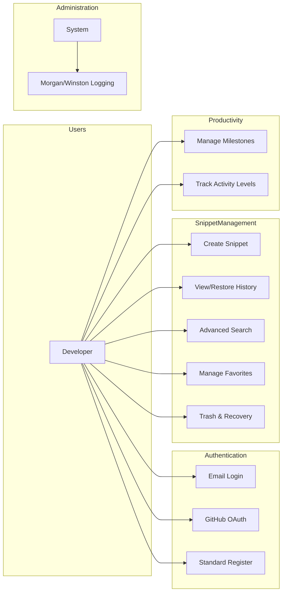

```mermaid
flowchart LR
    subgraph Users
        Developer
    end

    subgraph Authentication
        Developer --> LoginEmail[Email Login]
        Developer --> LoginGitHub[GitHub OAuth]
        Developer --> Register[Standard Register]
    end

    subgraph SnippetManagement
        Developer --> Create[Create Snippet]
        Developer --> VersionControl[View/Restore History]
        Developer --> Search[Advanced Search]
        Developer --> Favorites[Manage Favorites]
        Developer --> Trash[Trash & Recovery]
    end

    subgraph Productivity
        Developer --> Calendar[Manage Milestones]
        Developer --> Activity[Track Activity Levels]
    end

    subgraph Administration
        System --> Logs[Morgan/Winston Logging]
    end
```